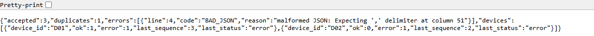
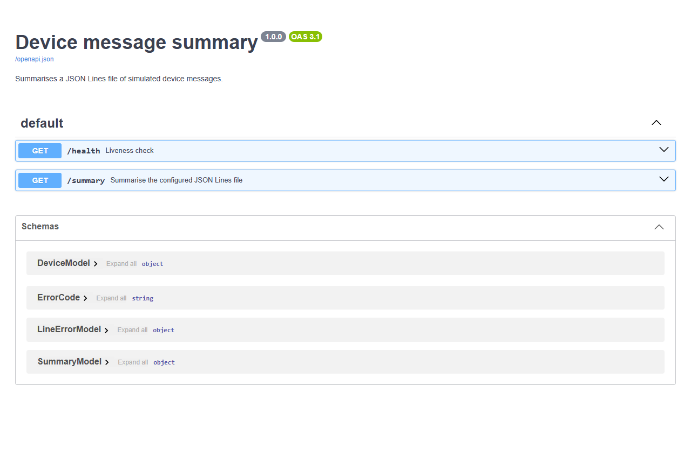
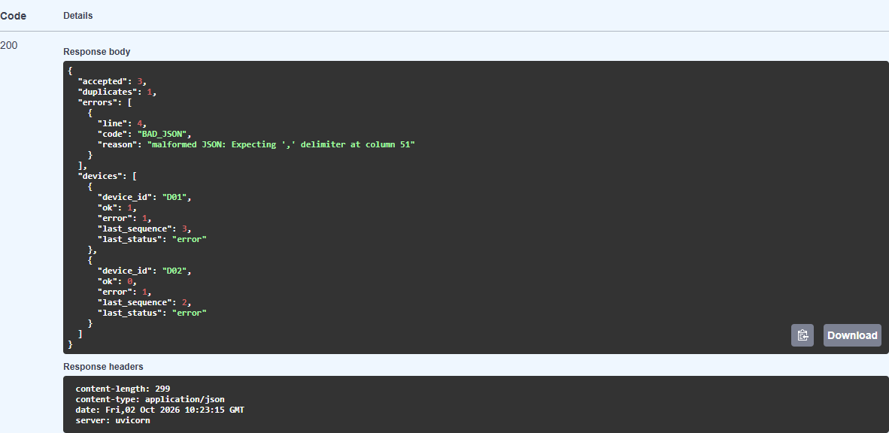
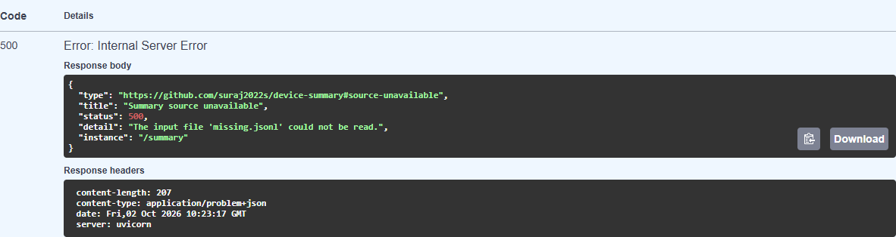
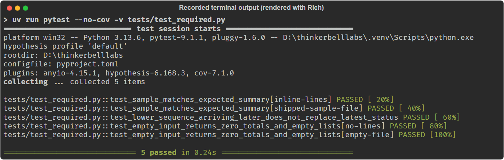
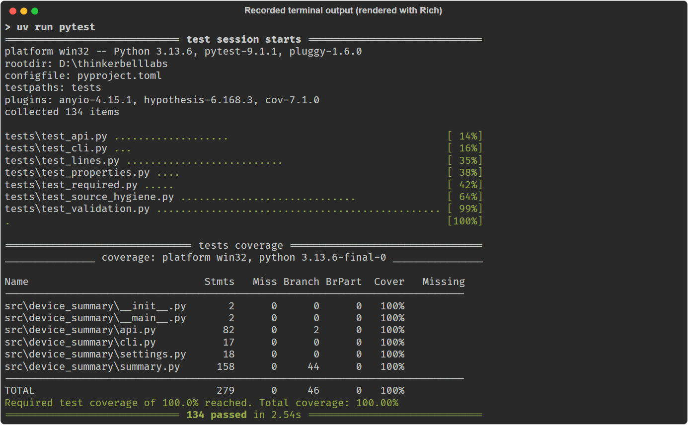

# Walkthrough

The written version of the 5-minute walkthrough: the same steps as the recording, with
real output captured from this repository. The timings in the headings are the
recording plan. The browser screenshots in [docs/images](docs/images) were captured
from the running server on 2 October 2026 with Microsoft Edge (headless, driven by
Playwright). The two test images are the recorded output of the real test commands,
rendered with the Rich library; the same output is also included as text.

## 1. What it does (0:00 to 0:30)

A JSON Lines file of device messages goes in; a summary comes out, over HTTP
(`GET /summary`) or the command line. Every rule in the brief lives in one module,
[src/device_summary/summary.py](src/device_summary/summary.py); the API and CLI are thin
layers on top of it.

## 2. Main flow (0:30 to 1:30)

The sample from the brief, [data/sample.jsonl](data/sample.jsonl):

```
{"device_id": "D01", "sequence": 1, "status": "ok"}
{"device_id": "D01", "sequence": 1, "status": "ok"}
{"device_id": "D02", "sequence": 2, "status": "error"}
{"device_id": "D03", "sequence": 1, "status": "ok"
{"device_id": "D01", "sequence": 3, "status": "error"}
```

Line 2 repeats line 1, and line 4 is missing its closing brace. Start the server and
call the endpoint (headers trimmed):

```
> uv run uvicorn device_summary.api:app
> curl.exe -i http://127.0.0.1:8000/summary
HTTP/1.1 200 OK
content-type: application/json

{"accepted":3,"duplicates":1,"errors":[{"line":4,"code":"BAD_JSON","reason":"malformed JSON: Expecting ',' delimiter at column 51"}],"devices":[{"device_id":"D01","ok":1,"error":1,"last_sequence":3,"last_status":"error"},{"device_id":"D02","ok":0,"error":1,"last_sequence":2,"last_status":"error"}]}
```

This matches the brief exactly: 3 accepted, 1 duplicate, 1 error; D01 has one ok and one
error with last status `error` from sequence 3; D02 has one error. D03 never appears,
because its only line was malformed. The CLI prints the same JSON without a server:
`uv run device-summary data/sample.jsonl`.

The same endpoint opened directly in the browser:



FastAPI also serves interactive documentation at `/docs`, listing both endpoints and
the response schemas:



Running `GET /summary` from there (**Try it out**, then **Execute**) shows the live
response: code 200, the formatted summary and the response headers:



## 3. Failure case (1:30 to 2:15)

Point the server at a file that does not exist:

```
> $env:DEVICE_SUMMARY_FILE = "missing.jsonl"
> uv run uvicorn device_summary.api:app
> curl.exe -i http://127.0.0.1:8000/summary
HTTP/1.1 500 Internal Server Error
content-type: application/problem+json

{"type":"https://github.com/suraj2022s/device-summary#source-unavailable","title":"Summary source unavailable","status":500,"detail":"The input file 'missing.jsonl' could not be read.","instance":"/summary"}
```

The brief says a read failure must not look like an empty successful result, so this
is a 500 in the standard RFC 9457 problem format, never a 200 with zeros. The client
sees only the file name; the server log has the configured path and the OS error:

```
Cannot read input file missing.jsonl: [Errno 2] No such file or directory: 'missing.jsonl'
```

The same failure in the interactive docs: code 500, content type
`application/problem+json`, and a body that names the problem without exposing the path:



A wrong method gets the same format: `POST /summary` returns `405` with `Allow: GET`.

## 4. Tests running (2:15 to 3:15)

The brief's three tests are in [tests/test_required.py](tests/test_required.py). The
sample test runs twice, on inline lines and on the shipped file, and the empty-input
test runs on no lines and on an empty file:



<details><summary>Same output as text</summary>

```
> uv run pytest --no-cov -v tests/test_required.py
tests/test_required.py::test_sample_matches_expected_summary[inline-lines] PASSED
tests/test_required.py::test_sample_matches_expected_summary[shipped-sample-file] PASSED
tests/test_required.py::test_lower_sequence_arriving_later_does_not_replace_latest_status PASSED
tests/test_required.py::test_empty_input_returns_zero_totals_and_empty_lists[no-lines] PASSED
tests/test_required.py::test_empty_input_returns_zero_totals_and_empty_lists[empty-file] PASSED
5 passed
```

</details>

The whole suite, with the coverage gate:



<details><summary>Same output as text</summary>

```
> uv run pytest
Name                             Stmts   Miss Branch BrPart  Cover
------------------------------------------------------------------
src\device_summary\__init__.py       2      0      0      0   100%
src\device_summary\__main__.py       2      0      0      0   100%
src\device_summary\api.py           82      0      2      0   100%
src\device_summary\cli.py           17      0      0      0   100%
src\device_summary\settings.py      18      0      0      0   100%
src\device_summary\summary.py      158      0     44      0   100%
------------------------------------------------------------------
TOTAL                              279      0     46      0   100%
Required test coverage of 100.0% reached. Total coverage: 100.00%
134 passed
```

</details>

Coverage only shows that code ran, so two more checks show the tests actually test
something. A Hypothesis property test compares the output with a plain restatement of
the brief on random inputs. `uv run python scripts/check_mutations.py` breaks one rule at
a time in `summary.py` (booleans accepted, duplicates not recorded, devices not sorted,
and so on) and confirms the suite fails every time: 16 of 16.

## 5. One design choice: decode, then parse, then validate (3:15 to 4:00)

Every line goes through the same three steps, and the first step that fails decides the
error code:

```python
try:
    record = _validate(_parse(_decode(raw, line_number)))
except _RejectedError as rejected:
    errors.append(LineError(line_number, rejected.code, rejected.reason))
    continue
```

- `_decode`: bytes to text. Invalid UTF-8 is `BAD_JSON`.
- `_parse`: text to a JSON value. Blank lines, broken syntax and `NaN` are `BAD_JSON`.
- `_validate`: JSON value to a record. Anything else wrong is `INVALID_RECORD`.

Why it is built this way:

- **Precedence is explicit.** A line with a duplicate key *and* broken syntax is
  `BAD_JSON`, because parsing fails before validation runs.
- **"Validate before checking duplicates" is enforced by structure.** Only a valid record
  gets past the `try`, so an invalid line can never claim a `(device_id, sequence)` pair.
- **Each rule in the brief is one visible check with its own message,** which is what
  lets the requirement table in the README point at a line of code and a test.

## 6. One defect found and fixed (4:00 to 4:50)

During development, the code that strips `\n` from each line was removed as redundant:
JSON ignores surrounding whitespace, and a mutation check agreed it changed no error
codes. (The AI assistant proposed the removal; see [AI_NOTE.md](AI_NOTE.md).) Running the
CLI on the sample then showed:

```
"reason": "malformed JSON: Expecting ',' delimiter at column 1"
```

The missing brace is at column 51. With the newline left in, Python's parser counted
the error as the start of a second line: "line 2, column 1". The error code was right,
but the message pointed at the wrong place, and no test looked at the column. The fix
restored the stripping. A regression test now checks the column for LF and CRLF files;
it fails without the fix and passes with it. The mutation script gained a matching
mutation.

The lesson: a mutation check only proves what the tests look at, and checking real
output caught what the automated checks could not. All defects are logged in
[docs/DEFECTS.md](docs/DEFECTS.md).

## 7. Wrap-up (4:50 to 5:00)

Known limitation: the file is re-read and re-validated on every request, and duplicate
tracking keeps every accepted pair in memory, so cost grows with file size. For large
files I would process incrementally or recompute only when the file changes.
